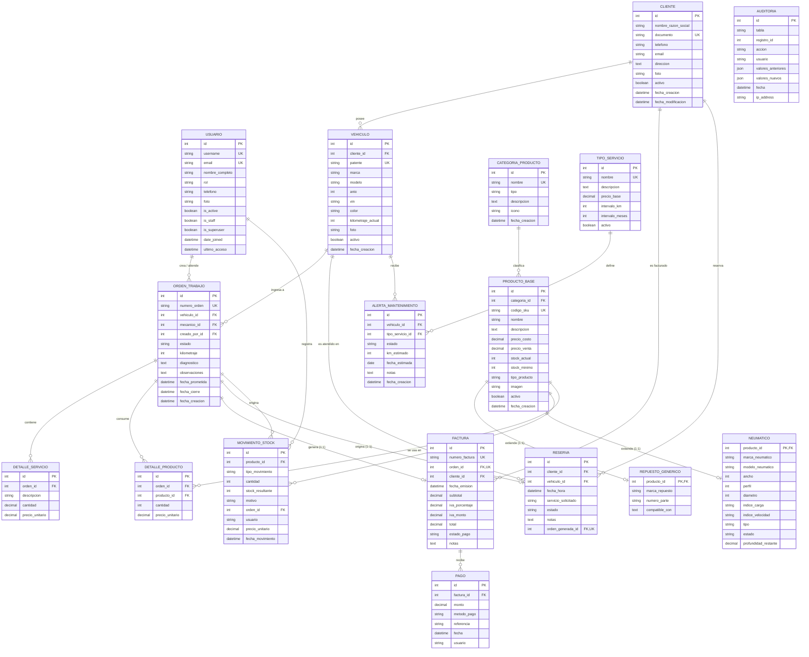

# 🗄️ Diccionario y Modelo de Base de Datos - Sistema TallerGes
**Motor de Base de Datos:** SQLite 3 (Entorno local) / PostgreSQL 14+ (Producción)  
**ORM:** Django ORM con migraciones automáticas  
**Patrón de Diseño:** Modelo Entidad-Relación Relacional Normalizado (3FN)  

---

## 1. Diagrama Entidad-Relación (Mermaid ERD)

---

## 2. Diccionario de Datos por Tablas

### 1. `accounts_usuario` (Usuarios y Personal)
| Campo | Tipo | Nulo | Descripción |
|---|---|---|---|
| `id` | INTEGER (PK AUTO) | NO | Identificador único del usuario |
| `username` | VARCHAR(50) | NO | Nombre de usuario (Único) |
| `email` | VARCHAR(254) | NO | Correo electrónico institucional (Único) |
| `nombre_completo` | VARCHAR(150) | NO | Nombre y apellido del empleado |
| `rol` | VARCHAR(20) | NO | `DUENO`, `ADMINISTRADOR`, `MECANICO` |
| `telefono` | VARCHAR(20) | SÍ | Teléfono de contacto directo |
| `foto` | VARCHAR(100) | SÍ | Ruta de imagen de perfil |
| `is_active` | BOOLEAN | NO | Estado de habilitación en el sistema |
| `is_staff` | BOOLEAN | NO | Acceso al panel administrativo |
| `date_joined` | DATETIME | NO | Fecha de alta |

---

### 2. `clientes_cliente` (Clientes del Taller)
| Campo | Tipo | Nulo | Descripción |
|---|---|---|---|
| `id` | INTEGER (PK AUTO) | NO | Identificador único |
| `nombre_razon_social` | VARCHAR(100) | NO | Razón social o Nombre completo |
| `documento` | VARCHAR(20) | NO | DNI o CUIT (Único) |
| `telefono` | VARCHAR(20) | SÍ | Teléfono principal / WhatsApp |
| `email` | VARCHAR(254) | SÍ | Correo electrónico para notificaciones |
| `direccion` | TEXT | SÍ | Dirección postal |
| `foto` | VARCHAR(100) | SÍ | Foto o documento escaneado |
| `activo` | BOOLEAN | NO | Estado activo/inactivo |

---

### 3. `vehiculos_vehiculo` (Parque Automotor)
| Campo | Tipo | Nulo | Descripción |
|---|---|---|---|
| `id` | INTEGER (PK AUTO) | NO | Identificador único del vehículo |
| `cliente_id` | INTEGER (FK) | NO | Relación con `clientes_cliente` |
| `patente` | VARCHAR(15) | NO | Dominio / Patente (Única) |
| `marca` | VARCHAR(50) | NO | Marca (ej: Toyota, Ford, Chevrolet) |
| `modelo` | VARCHAR(50) | NO | Modelo (ej: Hilux, Focus, Cruze) |
| `anio` | INTEGER | NO | Año de fabricación |
| `vin` | VARCHAR(30) | SÍ | Número de chasis (VIN) |
| `color` | VARCHAR(30) | SÍ | Color exterior |
| `kilometraje_actual` | INTEGER | NO | Odómetro actual en kilómetros |
| `activo` | BOOLEAN | NO | Estado operativo |

---

### 4. `inventario_productobase` (Catálogo General de Productos)
| Campo | Tipo | Nulo | Descripción |
|---|---|---|---|
| `id` | INTEGER (PK AUTO) | NO | Identificador del producto |
| `categoria_id` | INTEGER (FK) | NO | Relación con `inventario_categoriaproducto` |
| `codigo_sku` | VARCHAR(50) | NO | Código SKU único (`REP-XXXXX` / `NEU-XXXXX`) |
| `nombre` | VARCHAR(150) | NO | Denominación comercial |
| `precio_costo` | DECIMAL(12,2) | NO | Costo de adquisición unitario |
| `precio_venta` | DECIMAL(12,2) | NO | Precio de venta final al público |
| `stock_actual` | INTEGER | NO | Existencia física disponible en depósito |
| `stock_minimo` | INTEGER | NO | Umbral de alerta de reposición |
| `tipo_producto` | VARCHAR(20) | NO | `REPUESTO` o `NEUMATICO` |

---

### 5. `inventario_movimientostock` (Movimientos y Trazabilidad)
| Campo | Tipo | Nulo | Descripción |
|---|---|---|---|
| `id` | INTEGER (PK AUTO) | NO | Identificador del movimiento |
| `producto_id` | INTEGER (FK) | NO | Relación con `inventario_productobase` |
| `tipo_movimiento` | VARCHAR(20) | NO | `ENTRADA`, `SALIDA`, `AJUSTE`, `VENTA_DIRECTA` |
| `cantidad` | INTEGER | NO | Unidades ingresadas (+) o egresadas (-) |
| `stock_resultante` | INTEGER | NO | Saldo de stock tras la operación |
| `motivo` | VARCHAR(200) | NO | Detalle descriptivo / Factura de compra |
| `usuario` | VARCHAR(150) | SÍ | Nombre del usuario que registró la acción |
| `fecha_movimiento`| DATETIME | NO | Timestamp de registro |

---

### 6. `ordenes_ordentrabajo` (Órdenes de Servicio de Taller)
| Campo | Tipo | Nulo | Descripción |
|---|---|---|---|
| `id` | INTEGER (PK AUTO) | NO | Identificador único de orden |
| `numero_orden` | VARCHAR(20) | NO | Número correlativo anual (`YYYYMM####`) |
| `vehiculo_id` | INTEGER (FK) | NO | Relación con `vehiculos_vehiculo` |
| `mecanico_id` | INTEGER (FK) | SÍ | Mecánico asignado (`accounts_usuario`) |
| `creado_por_id` | INTEGER (FK) | SÍ | Usuario receptor de la orden |
| `estado` | VARCHAR(20) | NO | `PENDIENTE`, `EN_PROCESO`, `PAUSADA`, `COMPLETADA`, `FACTURADA`, `CANCELADA` |
| `kilometraje` | INTEGER | NO | Odómetro al momento del ingreso |
| `diagnostico` | TEXT | SÍ | Motivo de ingreso y fallas reportadas |
| `fecha_prometida` | DATETIME | SÍ | Compromiso de entrega pactado |

---

### 7. `facturas_factura` y `facturas_pago` (Cobranzas)
- **`facturas_factura`**:
  - `numero_factura` (Único), `orden_id` (1:1), `cliente_id` (FK), `subtotal`, `iva_monto`, `total`, `estado_pago` (`PENDIENTE`, `PARCIAL`, `PAGADA`, `ANULADA`).
- **`facturas_pago`**:
  - `factura_id` (FK), `monto`, `metodo_pago` (`EFECTIVO`, `TARJETA_DEBITO`, `TARJETA_CREDITO`, `TRANSFERENCIA`, `MERCADO_PAGO`, `CHEQUE`), `referencia`, `fecha`, `usuario`.
