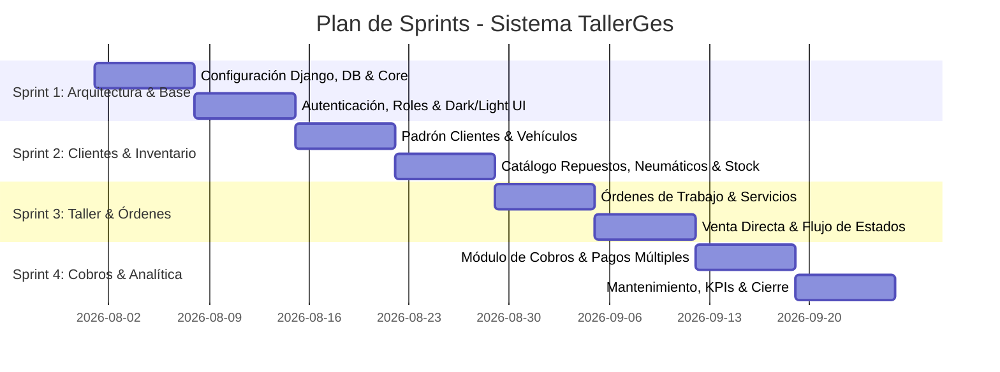

# 📋 Documento Metodología Scrum - Sistema TallerGes
**Proyecto:** Sistema de Gestión Integral para Taller Mecánico y Gomería  
**Metodología:** Marco Ágil Scrum (Iterativo e Incremental)  
**Duración del Proyecto:** 4 Sprints (Ciclos de 2 Semanas por Sprint)  

---

## 1. Equipo Scrum y Roles

| Rol Scrum | Responsable Asignado | Responsabilidades Principales |
|---|---|---|
| **Product Owner (PO)** | Dueño del Taller / Negocio | Definición de visión, priorización del Product Backlog, validación de criterios de aceptación y aceptación de incrementos de producto. |
| **Scrum Master (SM)** | Líder Técnico / Coordinador | Facilitación de ceremonias, remoción de impedimentos, aseguramiento de buenas prácticas ágiles y calidad del código. |
| **Development Team** | Desarrolladores Full-Stack & UI/UX | Arquitectura Django, diseño de base de datos, creación de interfaces accesibles (Light/Dark mode), lógica de negocio y pruebas. |

---

## 2. Definición de Hecho (Definition of Done - DoD)
Una Historia de Usuario se considera **Completada (Done)** únicamente cuando:
1. El código cumple con las convenciones PEP8 y estándares de Django.
2. Se implementaron los formularios con validaciones de datos y protección CSRF.
3. La interfaz se adapta al tema Claro y Oscuro sin errores de contraste.
4. Las fotos y formularios abren en modal/Lightbox sin romper la navegación.
5. Se incluye botón de retorno ("Atrás") y mensajes de retroalimentación al usuario (`django.contrib.messages`).
6. Se ejecutaron las migraciones y pruebas de integración satisfactoriamente.

---

## 3. Product Backlog por Épicas

```
[EP-01] Gestión de Seguridad, Usuarios y Acceso
[EP-02] Administración de Clientes y Parque Automotor
[EP-03] Control de Inventario, Repuestos y Gomería
[EP-04] Flujo Operativo de Órdenes de Trabajo
[EP-05] Gestión de Cobros, Pagos y Saldos
[EP-06] Mantenimiento Preventivo y Citas Programadas
[EP-07] Analítica, KPIs y Auditoría
```

---

## 4. Historias de Usuario (User Stories) y Criterios de Aceptación

### 🔹 ÉPICA 1: Seguridad y Usuarios
- **US-01: Inicio de Sesión y Control de Roles (Story Points: 5)**
  - *Como* usuario del taller,
  - *Quiero* ingresar al sistema con mi usuario y contraseña,
  - *Para* acceder a las funciones correspondientes a mi rol (Dueño, Administrador, Mecánico).
  - **Criterios de Aceptación:**
    - Dado un usuario activo con credenciales correctas, el sistema redirige al Dashboard principal.
    - Dado un usuario con credenciales incorrectas, se muestra mensaje de error sin revelar información sensible.
    - Los mecánicos tienen acceso restringido a operaciones financieras y de personal.

- **US-02: Gestión y Restablecimiento de Contraseñas (Story Points: 3)**
  - *Como* administrador o usuario,
  - *Quiero* cambiar mi contraseña o restablecer la de un empleado,
  - *Para* mantener la seguridad de las cuentas.
  - **Criterios de Aceptación:**
    - Formulario con confirmación de clave y validación de seguridad.
    - El administrador puede resetear la clave de cualquier mecánico desde la lista de personal.

---

### 🔹 ÉPICA 2: Clientes y Vehículos
- **US-03: Padrón y Ficha de Clientes (Story Points: 5)**
  - *Como* recepcionista/administrador,
  - *Quiero* registrar y buscar clientes por DNI, Razón Social o Teléfono,
  - *Para* consultar rápidamente su historial y vehículos asociados.
  - **Criterios de Aceptación:**
    - Búsqueda en tiempo real por coincidencia parcial.
    - Ficha detallada con lista de vehículos del cliente, órdenes pasadas y fotos en Lightbox.

- **US-04: Registro y Odómetro de Vehículos (Story Points: 5)**
  - *Como* mecánico/administrador,
  - *Quiero* registrar vehículos por patente, marca, modelo, VIN y kilometraje,
  - *Para* llevar la trazabilidad técnica de cada unidad que entra al taller.
  - **Criterios de Aceptación:**
    - Patente única normalizada en mayúsculas.
    - Actualización automática del kilometraje del vehículo al registrar una nueva orden de trabajo.

---

### 🔹 ÉPICA 3: Inventario y Stock
- **US-05: Ficha Especializada de Neumáticos y Repuestos (Story Points: 8)**
  - *Como* encargado de pañol/gomería,
  - *Quiero* catalogar repuestos y neumáticos con medidas técnicas (ancho, perfil, rodado),
  - *Para* encontrar rápidamente el producto compatible con cada vehículo.
  - **Criterios de Aceptación:**
    - Autogeneración de código SKU prefijado (`REP-` o `NEU-`).
    - Filtro por medidas de neumático y marca.

- **US-06: Carga y Ajuste Rápido de Stock (+ Stock) (Story Points: 5)**
  - *Como* administrador,
  - *Quiero* presionar el botón `+ Stock` en cualquier producto para registrar ingresos de mercadería con motivo y detalle,
  - *Para* mantener el stock real actualizado y trazable.
  - **Criterios de Aceptación:**
    - Registro de entradas, salidas y ajustes con cálculo automático del stock resultante.
    - Historial de movimientos visible en la misma ficha del producto.

- **US-07: Venta Directa de Mostrador (Story Points: 5)**
  - *Como* cajero/vendedor,
  - *Quiero* vender repuestos o neumáticos directamente a un cliente sin abrir una orden de trabajo,
  - *Para* agilizar ventas rápidas en el mostrador.
  - **Criterios de Aceptación:**
    - Validación de stock disponible antes de debitar.
    - Emisión instantánea de comprobante de entrega/recibo.

---

### 🔹 ÉPICA 4: Órdenes de Trabajo
- **US-08: Emisión y Asignación de Orden de Trabajo (Story Points: 8)**
  - *Como* jefe de taller,
  - *Quiero* crear una orden de trabajo asociando vehículo, mecánico y diagnóstico de ingreso,
  - *Para* planificar las tareas de reparación y mantenimiento.
  - **Criterios de Aceptación:**
    - Número de orden correlativo anual (`YYYYMM####`).
    - Selección modal o dropdown de vehículos activos con autocompletado del cliente.

- **US-09: Carga de Servicios y Repuestos en la Orden (Story Points: 8)**
  - *Como* mecánico asignado,
  - *Quiero* añadir servicios de mano de obra y repuestos utilizados a la orden,
  - *Para* que se calculen los costos, el IVA y el total a cobrar.
  - **Criterios de Aceptación:**
    - Cálculo dinámico de subtotales por ítem.
    - El stock del repuesto se descuenta automáticamente al cargarlo a la orden.

- **US-10: Ciclo de Vida y Transición de Estados (Story Points: 5)**
  - *Como* mecánico o jefe de taller,
  - *Quiero* cambiar el estado de la orden (Pendiente ➔ En Proceso ➔ Pausada ➔ Completada ➔ Cobrada),
  - *Para* coordinar el avance del trabajo y saber cuándo entregar el auto.
  - **Criterios de Aceptación:**
    - Botones de cambio de estado contextuales con badges de color.
    - Posibilidad de pausar o reabrir órdenes completadas antes de su cobro final.

---

### 🔹 ÉPICA 5: Cobros y Comprobantes
- **US-11: Registro de Cobros y Pagos Fraccionados (Story Points: 5)**
  - *Como* administrador,
  - *Quiero* emitir el comprobante de cobro de una orden y asentar pagos por efectivo, transferencia o tarjeta,
  - *Para* liquidar los saldos y cerrar financieramente el trabajo.
  - **Criterios de Aceptación:**
    - Soporte de pagos parciales con cálculo en vivo del saldo restante.
    - Marcado automático a estado `PAGADA` cuando el total cobrado iguala o supera el total de la orden.

---

### 🔹 ÉPICA 6 & 7: Mantenimiento, KPIs y Dashboard
- **US-12: Alertas de Mantenimiento Preventivo y Citas (Story Points: 5)**
  - *Como* asesor de servicio,
  - *Quiero* programar citas y recibir alertas por cambio de aceite o rotación de neumáticos según kilometraje,
  - *Para* fidelizar clientes y prevenir fallas mayores.

- **US-13: Tablero de Control y KPIs en Vivo (Story Points: 5)**
  - *Como* dueño del taller,
  - *Quiero* ver métricas clave (ingresos del mes, ganancias estimadas, órdenes abiertas, stock crítico),
  - *Para* tomar decisiones comerciales oportunas.

---

## 5. Planificación de Sprints



| Sprint | Objetivo Principal | Historias Entregadas | Total Story Points |
|---|---|---|---|
| **Sprint 1** | Arquitectura base, seguridad, roles de usuario y sistema de diseño adaptativo Claro/Oscuro. | US-01, US-02 | 8 pts |
| **Sprint 2** | Gestión de clientes, parque automotor, catálogo de repuestos/neumáticos y módulo `+ Stock`. | US-03, US-04, US-05, US-06 | 23 pts |
| **Sprint 3** | Motor de órdenes de trabajo, asignación técnica, consumo de inventario y venta rápida. | US-07, US-08, US-09, US-10 | 26 pts |
| **Sprint 4** | Módulo de cobros, pagos fraccionados, alertas preventivas, citas y Dashboard con KPIs. | US-11, US-12, US-13 | 15 pts |
| **TOTAL** | **Sistema Completo Funcional en Producción** | **13 Historias** | **72 Story Points** |
